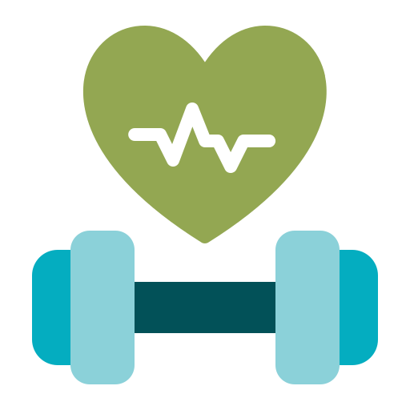
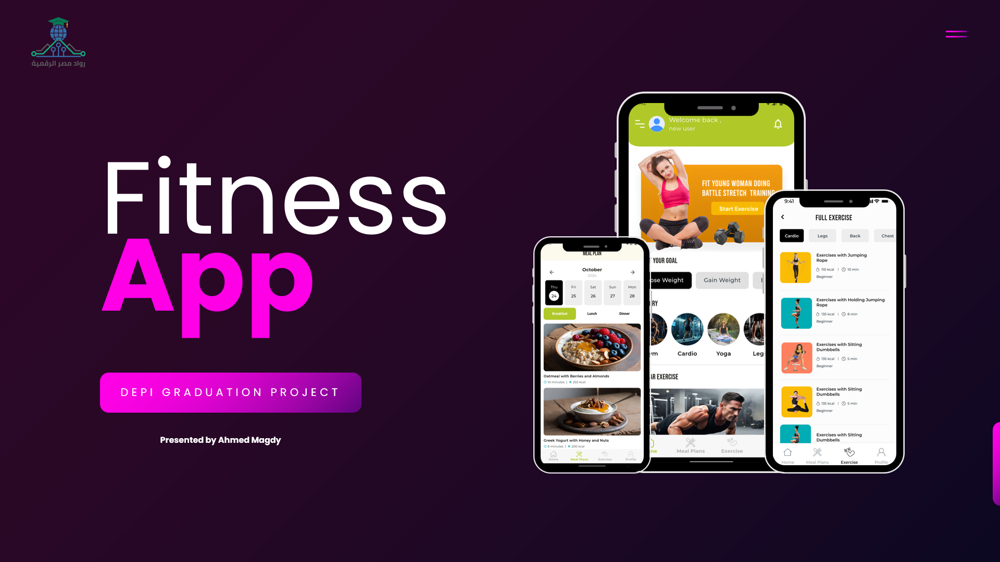

# **Fitness Tracker App**

### 🚀 **Overview**

The Fitness Tracker App is a cross-platform mobile application built using Flutter, designed to help
users monitor and improve their physical activity and health. The app provides real-time tracking of
various fitness metrics, including steps taken, calories burned, distance traveled, heart rate, and
more. With an intuitive user interface, the app allows users to set goals, track progress, and view
detailed analytics of their fitness journey.

---

### 🧹 **App Cover**

